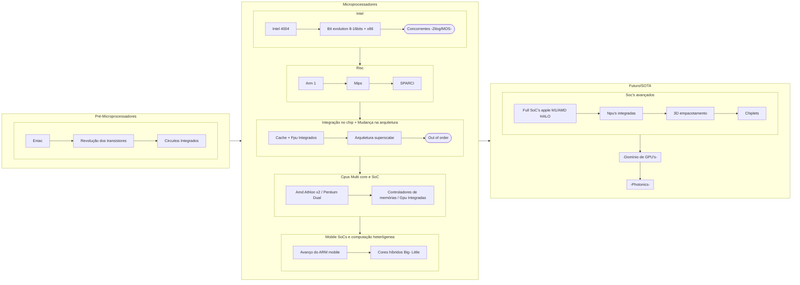

# Evolução dos Microprocessadores
### 3 principais fases
1. Pré microprocessadores
2. Microprocessadores
3. Futuro/SOTA

***
# 1. Pré-Microprocessadores
* Eniac
    * válvula e arquitetura
* Revolução do transistor
    * Bell Labs
* Circuitos Integrados
# 2. Microprocessadores
* Intel começo
    * Intel 4004
    * Bit evolution (8 -> 16bits) + x86 invention
    * -concorrentes (zilog / MOS)- 
* Risc arquitetura
    * Arm 1
    * Mips
    * SPARCI
* Integração no chip + Mudança na arquitetura
    * Cache e FPU no chip
    * Arquitetura Superscalar
    * -Out-of-order-
* Cpus Multi core e SoC
    * Amd Athlon x2 / Pentium Dual
    * Controladores de memórias / Gpu Integradas
* Mobile SoCs e computação heterôgenea
    * Avanço do ARM (mobile)
    * Cores híbridos (Big-  Little)
# 3. Futuro / SOTA
* Soc's avançados
    * Full SoC's (apple M1/AMD HALO) 
    * Npu's integradas
    * 3D empacotamento
    * Chiplets
* -Domínio de GPU's-
    * Nvidia Paralelism?
* -Photonics-

